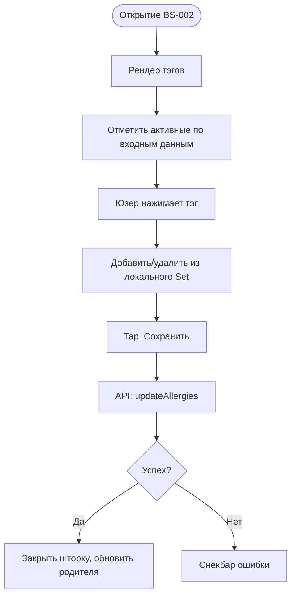

# Логика Настройки аллергий (BS-002)

**ID:** BS-002_LOGIC  
**Тип:** Логика Bottom Sheet  
**Домен:** 02. Профиль  
**Приоритет:** Medium

---

## Обзор

Обработка списка аллергий, синхронизация локального стейта с сервером через PATCH-запрос.

### User Story

> Как пользователь, я хочу обновлять свои аллергии,
> чтобы профиль оставался актуальным (US-140).

---

## Флоу

---

## API запросы

### PATCH /profile/allergies (`updateAllergies`)

**Параметры/Body:**
| Параметр | Тип | Значение |
|----------|-----|----------|
| `allergies` | array | Список выбранных строк-ключей аллергий |

**Обработка ответа:**
| Результат | Действие |
|-----------|----------|
| Загрузка | Спиннер на кнопке сохранения |
| Успех (200) | Закрытие BS, отправка события родительскому экрану для перерендера профиля |
| Сеть/5xx | Снекбар "Ошибка сохранения" |

---

## Связанные требования
- **FR-25** Аллергии (Medium Priority)
