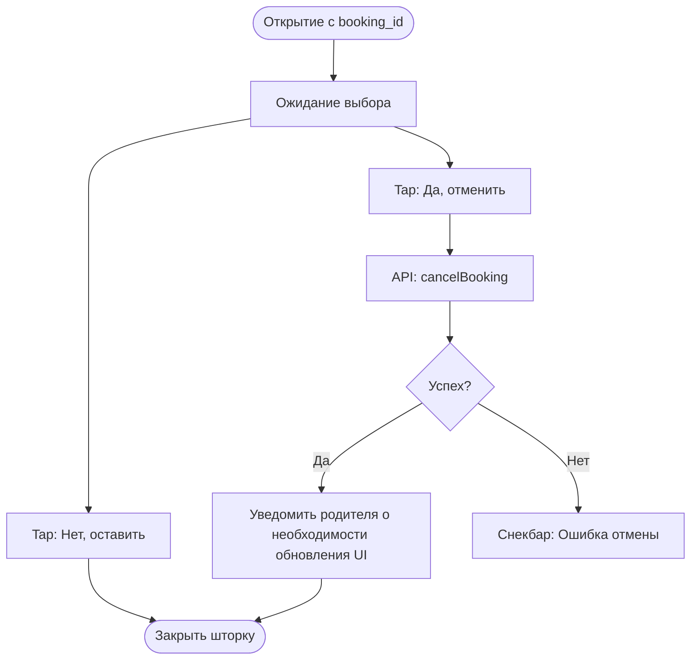

# Логика Отмены записи (BS-003)

**ID:** BS-003_LOGIC  
**Тип:** Логика Bottom Sheet  
**Домен:** 04. Бронирование  
**Приоритет:** High

---

## Обзор

Простая логика подтверждения опасного действия.

---

## Флоу

---

## API запросы

### POST /bookings/{id}/cancel (`cancelBooking`)

**Обработка ответа:**
| Результат | Действие |
|-----------|----------|
| Успех (200) | Закрытие BS. Запись пропадает из активных списков на вызывающем экране (PTR или локальное удаление из стейта). |

## Связанные требования
- **FR-85** Отмена бронирования (High)
