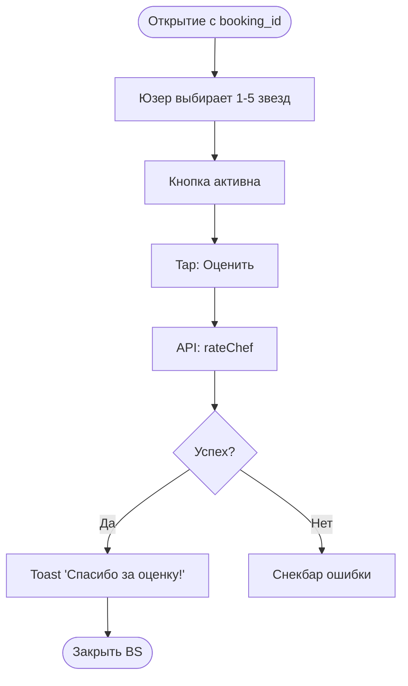

# Логика Оценки шефа (BS-004)

**ID:** BS-004_LOGIC  
**Тип:** Логика Bottom Sheet  
**Домен:** 04. Бронирование  
**Приоритет:** Low

---

## Обзор

Логика компонента оценки (Stars Rating) и отправки результата на бэкенд.

---

## Флоу

---

## API запросы

### POST /bookings/{id}/rating (`rateChef`)

**Параметры/Body:**
| Параметр | Тип | Значение |
|----------|-----|----------|
| `rating` | Int | 1..5 |

**Обработка ответа:**
Успешный 200 ответ завершает флоу оценки.

## Связанные требования
- **FR-100** Оценка шефа (Low Priority)

---

## Обработка ошибок

| Тип ошибки | Контекст | Действие |
|------------|----------|----------|
| 401 Unauthorized | Глобальная | Принудительный разлогин, очистка Bearer токена и перенаправление на экран авторизации SCR-001 |
| 5xx Server Error | Оценка шефа | Системный алерт "Сервис временно недоступен. Попробуйте позже" |
| NETWORK_ERR | Оценка шефа | Системный алерт "Отсутствует подключение к сети" |
