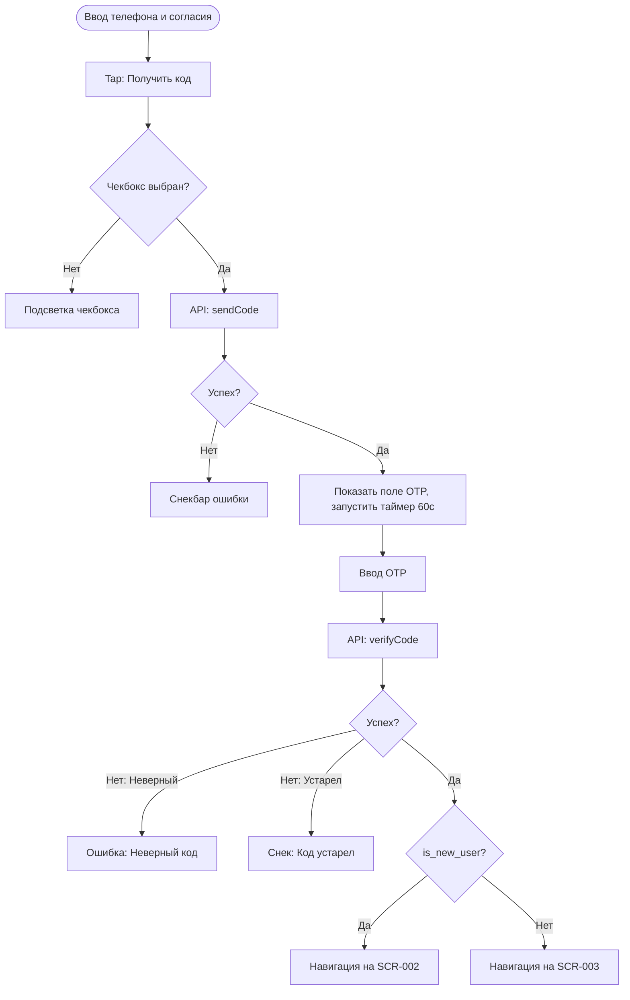

# Логика Экрана Входа (SCR-001)

**ID:** SCR-001_LOGIC  
**Тип:** Логика экрана  
**Домен:** 01. Авторизация  
**Приоритет:** High  
**Статус:** Черновик  
**Функциональные блоки:** FB-AUTH-001

---

## Обзор

Описывает процесс запроса одноразового кода по номеру телефона и его проверку, обработку ответов API (сценарии нового и существующего пользователя), а также работу с таймером повторной отправки.

### User Story

> Как пользователь, я хочу авторизоваться по SMS коду,
> чтобы пользоваться приложением (US-10).

---

## Флоу

---

## API запросы

### POST /auth/send-code (`sendCode`)

**Триггер:** Нажатие кнопки "Получить код" или "Запросить повторно".

**Параметры/Body:**
| Параметр | Тип | Описание | Значение/Источник |
|----------|-----|----------|-------------------|
| `phone` | string | Номер телефона | Поле ввода |
| `personal_data_consent` | bool | Флаг согласия | Чекбокс |

**Обработка ответа:**
| Результат | Действие |
|-----------|----------|
| Загрузка | Спиннер на кнопке / блокировка инпута |
| Успех (200) | Показать поле OTP. Запустить таймер на 60 секунд для кнопки "Запросить повторно". |
| Ошибка сети | Снек "Проверьте подключение к интернету" |

---

### POST /auth/verify-code (`verifyCode`)

**Триггер:** Ввод последней цифры кода в поле OTP.

**Параметры/Body:**
| Параметр | Тип | Описание | Значение/Источник |
|----------|-----|----------|-------------------|
| `phone` | string | Номер телефона | Сохраненное значение с предыдущего шага |
| `code` | string | OTP код | Ввод пользователя |

**Обработка ответа:**
| Результат | Действие |
|-----------|----------|
| Загрузка | Спиннер |
| Успех (200) | Сохранение токена локально. Проверка флага `is_new_user` в ответе (AuthResponse). Если `true` -> переход на SCR-002, если `false` -> переход на SCR-003. |
| Ошибка 4xx (`code: "INVALID_OTP"`) | Подсветка поля OTP красным с текстом "Неверный код" |
| Ошибка 4xx (`code: "OTP_EXPIRED"`) | Снекбар "Код устарел". Очистка поля OTP. |

---

## Локальное хранение

| Ключ | Тип хранения | Описание |
|------|--------------|----------|
| `auth_token` | Защищённое хранилище | Bearer токен пользователя (из `token` в ответе `AuthResponse`) |

---

## Связанные требования

### Функциональные
- **FR-10** Авторизация по номеру телефона
- **FR-20** Сбор согласия на обработку ПД (High)

---

## Обработка ошибок

| Тип ошибки | Контекст | Действие |
|------------|----------|----------|
| NETWORK_ERR | Отправка или проверка кода | Снекбар "Проверьте подключение к интернету" |
| OTP_EXPIRED | Проверка кода | Снекбар "Код устарел", кнопка повторного запроса становится активной (сброс таймера) |
| INVALID_OTP | Проверка кода | Подсветка инпута красным с текстом "Неверный код" |
