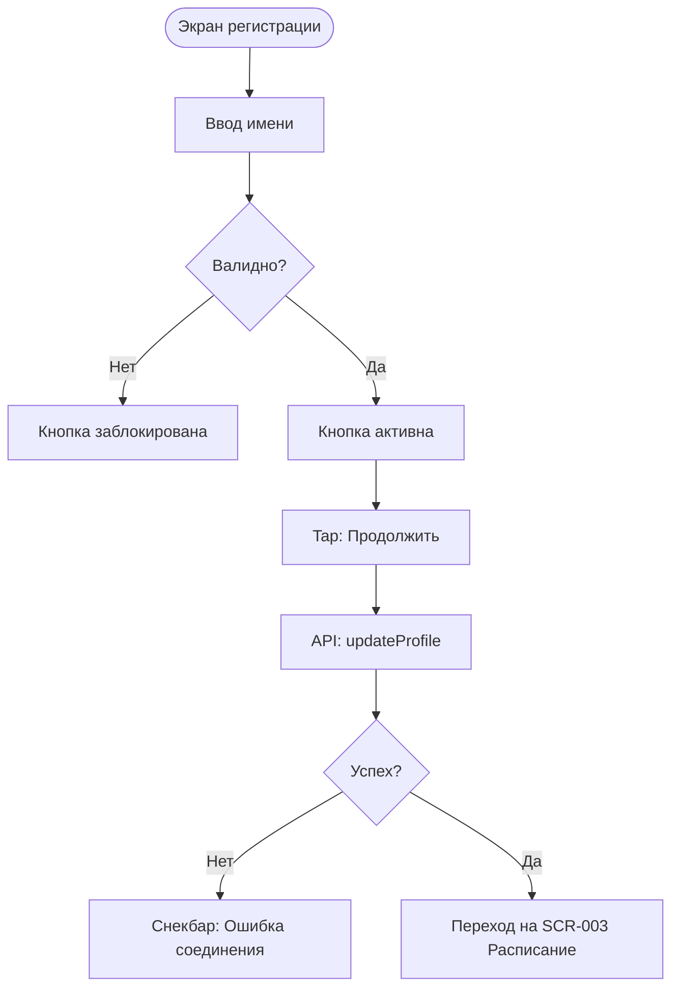

# Логика Экрана Регистрации (SCR-002)

**ID:** SCR-002_LOGIC  
**Тип:** Логика экрана  
**Домен:** 02. Профиль  
**Приоритет:** High  
**Статус:** Черновик  
**Функциональные блоки:** FB-PROFILE-001

---

## Обзор

Описывает логику сохранения имени пользователя при первичной регистрации и перехода на главный экран.

### User Story

> Как новый пользователь, я хочу указать свое имя,
> чтобы персонализировать свой профиль (US-20).

---

## Флоу

---

## API запросы

### PATCH /profile (`updateProfile`)

**Триггер:** Нажатие кнопки "Продолжить".

**Headers:**
| Поле | Описание |
|------|----------|
| `authorization` | Bearer токен |

**Параметры/Body:**
| Параметр | Тип | Описание | Значение/Источник |
|----------|-----|----------|-------------------|
| `firstname` | string | Имя пользователя | Поле ввода имени |

**Обработка ответа:**
| Результат | Действие |
|-----------|----------|
| Загрузка | Индикатор загрузки на кнопке |
| Успех (200) | Переход на экран расписания (SCR-003) |
| Ошибка сети | Снек "Ошибка соединения, попробуйте еще раз" |
| Ошибка 4xx | Снекбар с текстом `message` из ответа `ErrorResponse` |

---

## Связанные требования

- **FR-15** Заполнение имени при регистрации

---

## Обработка ошибок

| Тип ошибки | Контекст | Действие |
|------------|----------|----------|
| NETWORK_ERR | Отправка имени на сервер | Снекбар "Ошибка соединения, попробуйте еще раз" |
