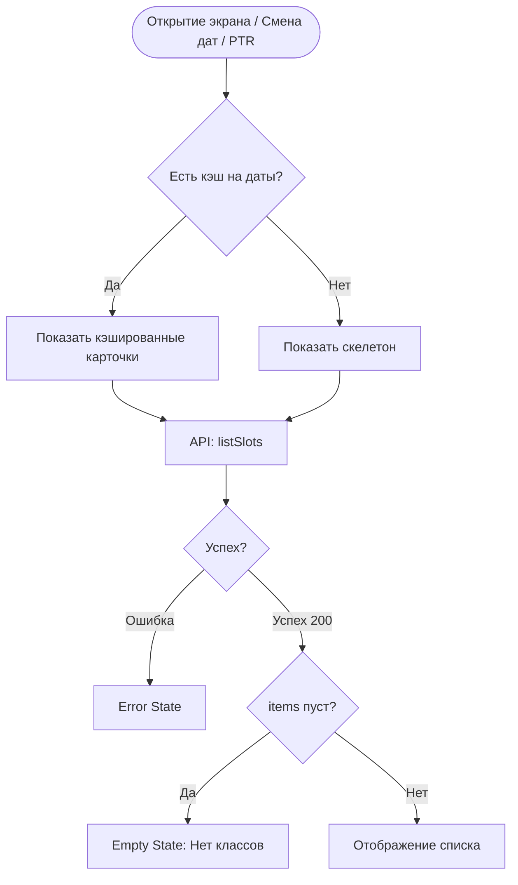

# Логика Экрана Расписания (SCR-003)

**ID:** SCR-003_LOGIC  
**Тип:** Логика экрана  
**Домен:** 03. Слоты и Расписание  
**Приоритет:** High  
**Статус:** Черновик  
**Функциональные блоки:** FB-SCHED-001

---

## Обзор

Логика загрузки списка доступных слотов на основе выбранного временного окна (по умолчанию 7 дней), обработки пустых ответов и ошибок сети.

### User Story

> Как пользователь, я хочу видеть актуальное расписание мастер-классов,
> чтобы выбрать время и записаться (US-40).

---

## Флоу

---

## API запросы

### GET /slots (`listSlots`)

**Триггер:** 
1. onEnter (инициализация)
2. pull-to-refresh
3. Смена дат в фильтре

**Headers:**
| Поле | Описание |
|------|----------|
| `authorization` | Bearer токен |

**Параметры:**
| Параметр | Тип | Описание | Значение |
|----------|-----|----------|----------|
| `start_date` | string | Дата начала | Сегодня (или выбранная в фильтре) |
| `end_date` | string | Дата окончания | Сегодня + 7 дней (или выбранная в фильтре) |

**Обработка ответа:**
| Результат | Действие |
|-----------|----------|
| Успех (200) | Обновление списка карточек. Сохранение в кэш. |
| Ошибка сети / 5xx | Показ полноэкранного Error State "Не удалось загрузить расписание" с кнопкой "Обновить" |

---

## Дополнительная логика

- **Политика кэширования:** Инвалидация кэша расписания (TTL) составляет 5-10 минут для предотвращения бронирования устаревших слотов.
- **Вычисление доступности (Frontend):**
  - Если `status == 'CANCELLED'` -> Карточка визуально недоступна (серая), плашка "Отменен".
  - Если `status == 'SCHEDULED'` И `available_seats == 0` -> Карточка визуально недоступна, плашка "Мест нет".
  - В обоих случаях карточки остаются кликабельными, чтобы пользователь мог зайти на экран деталей (где кнопка бронирования будет заблокирована).

---

## Обработка ошибок

| Тип ошибки | Контекст | Действие |
|------------|----------|----------|
| 401 Unauthorized | Глобальная | Принудительный разлогин, очистка Bearer токена и перенаправление на экран авторизации SCR-001 |
| 5xx Server Error | Загрузка расписания | Системный алерт "Сервис временно недоступен. Попробуйте позже" |
| NETWORK_ERR | Загрузка расписания | Системный алерт "Отсутствует подключение к сети". Плейсхолдер ошибки на весь контент + кнопка "Обновить" |
