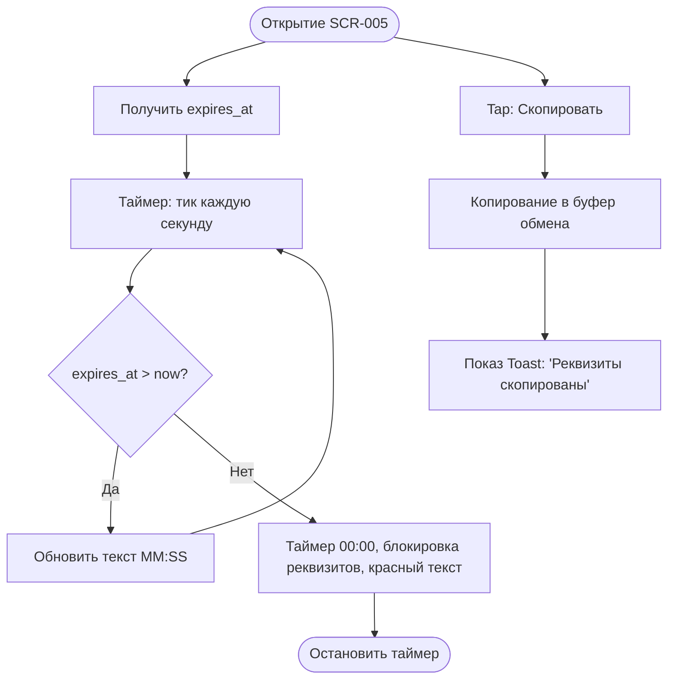

# Логика Инструкции по оплате (SCR-005)

**ID:** SCR-005_LOGIC  
**Тип:** Логика экрана  
**Домен:** 04. Бронирование  
**Приоритет:** Medium

---

## Обзор

Логика работы обратного таймера, отсчитывающего время до истечения срока оплаты бронирования. 

### User Story

> Как пользователь, я хочу видеть обратный отсчет,
> чтобы понимать актуальность предоставленных реквизитов (BR-40).

---

## Флоу

---

## Локальное вычисление

- **Таймер:** При инициализации высчитывается дельта: `Diff = expires_at - DateTime.now()`. 
- Интервал обновляет UI. Если пользователь сворачивает приложение и разворачивает, дельта пересчитывается заново, чтобы исключить рассинхрон из-за паузы потока UI.

## Связанные требования

- **BR-40** Бронь удерживается 1 час. (Клиент только отображает `expires_at`, полученный от бэкенда).

---

## Обработка ошибок

| Тип ошибки | Контекст | Действие |
|------------|----------|----------|
| 401 Unauthorized | Глобальная | Принудительный разлогин, очистка Bearer токена и перенаправление на экран авторизации SCR-001 |
| 5xx Server Error | Глобальная | Системный алерт "Сервис временно недоступен. Попробуйте позже" |
| NETWORK_ERR | Глобальная | Системный алерт "Отсутствует подключение к сети" |
