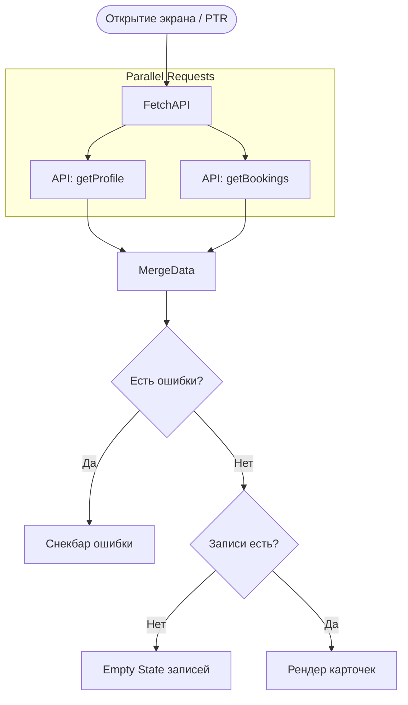

# Логика Экрана Профиля и Записей (SCR-006)

**ID:** SCR-006_LOGIC  
**Тип:** Логика экрана  
**Домен:** 02. Профиль / 04. Бронирование  
**Приоритет:** High

---

## Обзор

Параллельная загрузка данных профиля пользователя и списка его активных бронирований. Обработка пустого списка и навигация.

### User Story

> Как пользователь, я хочу быстро посмотреть свои данные и записи,
> чтобы управлять своим участием в классах (US-130).

---

## Флоу

---

## API запросы

### GET /profile (`getProfile`)
**Триггер:** onEnter / Pull-to-refresh
**Обработка ответа:** Сохранение данных клиента локально для отображения аллергий.

### GET /bookings (`getBookings`)
**Триггер:** onEnter / Pull-to-refresh
**Обработка ответа:** 
- Получение списка `Booking`.
- Если список не содержит расширенной информации о слоте, клиент может отобразить ID, либо параллельно инициировать пакетный/кэшированный запрос `getSlot(slot_id)` для отображения названий классов. *(В MVP обычно бэкенд возвращает расширенный объект бронирования или данные слота приклеиваются)*

## Дополнительная логика UI
- **Статусы брони (Validation):** 
  - Если `status == 'CANCELLED_BY_STUDIO'` — Карточка окрашивается в серый/красный цвет, кнопка отмены скрывается, добавляется плашка "Отменена студией".
- **Логаут:** Нажатие на кнопку "Выйти" очищает защищенное хранилище (токен) и перебрасывает пользователя на SCR-001 (навигационный стек сбрасывается).

---

## Обработка ошибок

| Тип ошибки | Контекст | Действие |
|------------|----------|----------|
| NETWORK_ERR | Загрузка данных | Показ снекбара. Если кэш пуст — Error State на месте списков. |
